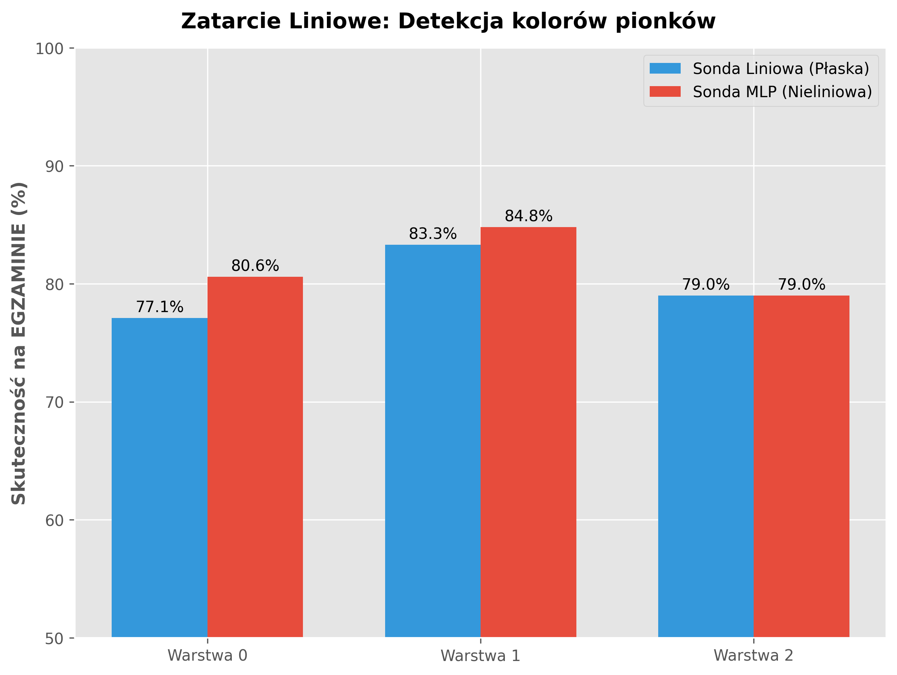
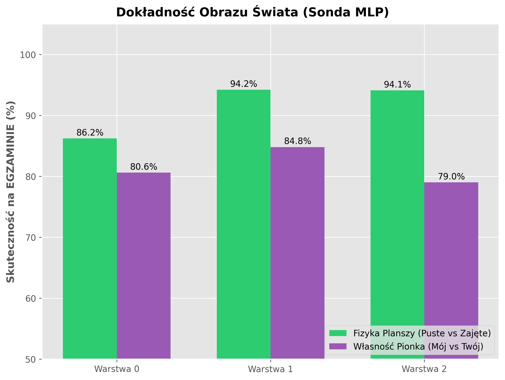

# Sprawozdanie z badań

## Analiza reprezentacji neuronowych w modelu Transformer uczonym gry w kółko i krzyżyk

### Streszczenie

Celem projektu było zbadanie, czy mały model Transformer, trenowany wyłącznie na płaskich sekwencjach legalnych ruchów w grze w kółko i krzyżyk, wytwarza wewnętrzną reprezentację stanu planszy. Model nie otrzymywał obrazu planszy, jawnie zakodowanych reguł gry ani informacji o strategii wygrywającej. Jego jedynym zadaniem było przewidywanie następnego tokenu w sekwencji ruchów.

Wyniki wskazują, że model nie uczy się wyłącznie powierzchownych statystyk tokenów. W jego aktywacjach pojawia się dekodowalna reprezentacja świata gry: informacja o polach pustych, zajętych oraz o relatywnej własności pionków. Co ważniejsze, interwencje przyczynowe pokazują, że ta reprezentacja jest używana podczas podejmowania decyzji, ponieważ sztuczna zmiana zakodowanego stanu pola potrafi zmienić rozkład prawdopodobieństwa kolejnych ruchów.

Najsilniejszym wynikiem jest dekodowanie fizycznego stanu planszy. Dla środkowej warstwy modelu sonda MLP osiągnęła `95.2%` poprawności w rozpoznawaniu, czy pole jest puste czy zajęte. Model osiągnął też `97.81%` top-1 legalności predykcji ruchu, mimo że dokładne przewidywanie konkretnego następnego tokenu jest utrudnione przez losowy charakter danych treningowych.

---

## 1. Wprowadzenie

Współczesne modele neuronowe często osiągają dobre wyniki bez jawnie zaprogramowanej reprezentacji świata, na którym operują. Powstaje więc pytanie, czy taka reprezentacja może wyłonić się samoistnie jako skutek optymalizacji prostego zadania predykcyjnego.

W tym projekcie wykorzystano uproszczone środowisko badawcze: grę w kółko i krzyżyk. Jest to dobry przypadek testowy, ponieważ stan świata jest w pełni znany badaczowi, a jednocześnie model otrzymuje go jedynie pośrednio, jako sekwencję indeksów pól. Dzięki temu można porównać prawdziwy stan planszy z informacją zakodowaną wewnątrz aktywacji modelu.

Badanie należy do obszaru mechanistycznej interpretowalności. Nie chodziło wyłącznie o sprawdzenie, czy model poprawnie gra, lecz o zrozumienie, jakie struktury informacyjne powstają w jego warstwach ukrytych i czy mają wpływ na decyzje wyjściowe.

---

## 2. Cel badania i hipotezy

Głównym celem badania było sprawdzenie, czy autoregresyjny model Transformer, uczony tylko predykcji następnego ruchu, tworzy wewnętrzny model planszy.

Sformułowano trzy pytania badawcze:

1. Czy w aktywacjach modelu da się odczytać fizyczny stan planszy, czyli informację, które pola są puste, a które zajęte?
2. Czy model koduje również bardziej złożoną informację relatywną: które pionki należą do gracza wykonującego następny ruch, a które do przeciwnika?
3. Czy wykryta reprezentacja ma znaczenie przyczynowe dla decyzji modelu, czy jest jedynie korelacją możliwą do odczytania przez zewnętrzną sondę?

Hipoteza główna:

> Model Transformer trenowany wyłącznie na legalnych sekwencjach ruchów wytwarza w aktywacjach ukrytych reprezentację stanu planszy, ponieważ bez takiej reprezentacji trudno byłoby stabilnie unikać ruchów nielegalnych.

---

## 3. Materiał badawczy

Dane składały się z `10 000` syntetycznie wygenerowanych, legalnych partii kółka i krzyżyka. Każda partia była reprezentowana jako sekwencja liczb od `0` do `8`, odpowiadających polom planszy, zakończona tokenem `9` oznaczającym koniec gry. Token `10` był używany jako padding sekwencji wejściowych.

Dane nie zawierały jawnej strategii optymalnej. Ruchy były losowane spośród legalnych ruchów dostępnych w danym stanie. W konsekwencji model nie był uczony "jak wygrać", lecz jak przewidywać prawdopodobne legalne kontynuacje gry.

Rozkład długości partii:

| Długość gry | Liczba partii |
|---:|---:|
| 5 ruchów | 965 |
| 6 ruchów | 895 |
| 7 ruchów | 2 633 |
| 8 ruchów | 1 962 |
| 9 ruchów | 3 545 |

Z `10 000` partii uzyskano `76 227` prefiksów treningowych. Każdy prefiks służył jako wejście, a następujący po nim token jako etykieta predykcyjna.

---

## 4. Badany model

Badanym modelem był mały autoregresyjny Transformer `TinyTicTacToeGPT`. Model działał jak językowy model sekwencyjny: na podstawie dotychczasowych tokenów przewidywał następny token.

Parametry architektury:

| Element | Wartość |
|---|---:|
| Liczba tokenów słownika | 11 |
| Maksymalna długość pozycyjna | 10 |
| Wymiar ukryty `d_model` | 128 |
| Liczba warstw Transformera | 3 |
| Liczba głów uwagi | 8 |
| Liczba parametrów | 1 783 179 |

Model używał maski przyczynowej, więc podczas przewidywania danego ruchu nie miał dostępu do przyszłych tokenów. Każda pozycja widziała tylko wcześniejszą historię gry.

Trening prowadzono przez `15` epok z optymalizatorem `AdamW` i funkcją straty `CrossEntropyLoss`. Strata spadła z `1.6304` w pierwszej epoce do `1.3405` w ostatniej epoce. Sama strata nie jest jednak głównym wynikiem badania, ponieważ przy losowych danych dokładne przewidzenie konkretnego następnego ruchu nie jest jednoznacznym miernikiem jakości rozumienia gry.

---

## 5. Metodologia badawcza

Badanie składało się z czterech etapów:

1. Ocena zachowania wyjściowego modelu.
2. Ekstrakcja aktywacji z warstw ukrytych.
3. Dekodowanie informacji o planszy za pomocą sond.
4. Testy istotności i interwencje przyczynowe.

### 5.1. Ocena legalności predykcji

Ponieważ dane treningowe powstały przez losowanie legalnych ruchów, dokładne trafienie następnego tokenu nie jest wystarczającą miarą. Jeśli w danym stanie dostępnych jest pięć legalnych ruchów, generator wybiera jeden z nich losowo. Model może więc wskazać inny legalny ruch i nadal wykazywać poprawne rozumienie ograniczeń gry.

Z tego powodu analizowano:

- dokładność top-1 względem konkretnego tokenu z danych,
- legalność top-1 predykcji,
- masę prawdopodobieństwa przypisaną legalnym tokenom,
- zachowanie modelu w stanach terminalnych.

### 5.2. Ekstrakcja aktywacji

Aby zbadać wewnętrzną reprezentację modelu, zapisano aktywacje z trzech warstw Transformera. Użyto forward hooks, które przechwytują wyjścia warstw podczas normalnego przebiegu modelu.

Dla każdej partii zapisano:

- aktywacje warstwy 0,
- aktywacje warstwy 1,
- aktywacje warstwy 2,
- prawdziwą historię stanów planszy odtworzoną z sekwencji ruchów.

Uzyskany zbiór aktywacji miał kształt:

| Dane | Kształt |
|---|---|
| Aktywacje warstwy 0 | `(10000, 9, 128)` |
| Aktywacje warstwy 1 | `(10000, 9, 128)` |
| Aktywacje warstwy 2 | `(10000, 9, 128)` |
| Stany planszy | `(10000, 9, 9)` |

Wymiar `128` odpowiada przestrzeni ukrytej modelu. To w tej przestrzeni poszukiwano informacji o stanie planszy.

### 5.3. Sondowanie reprezentacji

Do dekodowania aktywacji użyto sond, czyli klasyfikatorów trenowanych na zamrożonych reprezentacjach modelu. Sondy nie zmieniały wag Transformera. Ich zadaniem było sprawdzenie, czy informacja o planszy jest dostępna w aktywacjach.

Porównano dwa typy sond:

- sonda liniowa: jedna warstwa `128 -> 27`,
- sonda MLP: warstwy `128 -> 256 -> 27` z nieliniowością ReLU.

Wyjście `27` odpowiadało klasyfikacji `3 x 9`: dla każdego pola planszy model sondy przewidywał jeden z trzech stanów:

- pole puste,
- mój pionek,
- pionek przeciwnika.

Istotnym elementem było użycie reprezentacji relatywnej. Zamiast kodować absolutnie X i O, planszę tłumaczono względem gracza wykonującego następny ruch. Dzięki temu badanie sprawdzało, czy model reprezentuje sytuację z perspektywy decyzyjnej, a nie tylko pamięta historię symboli.

### 5.4. Mapy istotności

W projekcie rozróżniono dwa rodzaje istotności:

- istotność historyczną, czyli wpływ poprzednich tokenów ruchów,
- istotność przestrzenną, czyli wpływ konkretnych pól planszy.

Finalna analiza skupiała się na istotności przestrzennej. W tym celu połączono gradient decyzji modelu z wektorami koncepcyjnymi wytrenowanej sondy liniowej. Dla każdego pola obliczano, jak silnie kierunek gradientu zgadza się z wektorem reprezentującym dany stan pola.

Ta metoda pozwalała przejść od pytania "który token historii był ważny?" do pytania "które pole w wewnętrznej mapie planszy wpłynęło na decyzję?".

### 5.5. Interwencje przyczynowe

Sondowanie może wykazać, że dana informacja jest obecna w aktywacjach, ale samo w sobie nie dowodzi, że model tej informacji używa. Dlatego wykonano interwencje przyczynowe.

Idea eksperymentu była następująca:

1. Znaleźć wektor sondy odpowiadający konkretnemu pojęciu, np. "pole 2 jest puste".
2. Znaleźć wektor odpowiadający pojęciu przeciwnemu, np. "pole 2 jest zajęte przez przeciwnika".
3. W czasie działania modelu zmodyfikować aktywację tak, aby odjąć reprezentację prawdziwego stanu i dodać reprezentację stanu fałszywego.
4. Sprawdzić, czy zmieniają się logity i prawdopodobieństwa ruchów.

Jeżeli po takiej manipulacji model zmienia decyzje, oznacza to, że reprezentacja nie jest wyłącznie biernym śladem informacji, ale częścią obliczenia prowadzącego do wyniku.

---

## 6. Wyniki

### 6.1. Zachowanie modelu na poziomie wyjścia

Model osiągnął niską dokładność dokładnego następnego tokenu, ale bardzo wysoką legalność wyboru. Jest to oczekiwane przy losowym charakterze danych.

| Metryka | Wynik |
|---|---:|
| Top-1 dokładność dokładnego następnego tokenu | 35.25% |
| Top-1 legalność predykcji | 97.81% |
| Średnia masa prawdopodobieństwa na legalnych tokenach | 97.00% |
| Top-1 legalność dla prefiksów niekońcowych | 97.61% |
| Średnia masa prawdopodobieństwa na nielegalnych tokenach dla prefiksów niekońcowych | 3.30% |
| Top-1 rozpoznanie końca gry dla prefiksów terminalnych | 99.09% |

Wynik ten pokazuje, że model nauczył się silnie ograniczać przestrzeń decyzji do legalnych ruchów. Nie jest to trywialne, ponieważ legalność ruchu zależy od całej wcześniejszej historii gry.

### 6.2. Dekodowanie pełnego relatywnego stanu planszy

Pierwszy eksperyment sondowania sprawdzał, czy z aktywacji można zrekonstruować pełny relatywny stan planszy: puste pola, własne pionki i pionki przeciwnika.

| Warstwa | Sonda liniowa | Sonda MLP |
|---|---:|---:|
| 0 | 76.6% | 86.5% |
| 1 | 82.7% | 88.9% |
| 2 | 78.7% | 79.8% |

Najlepsze wyniki uzyskano w warstwie 1. To sugeruje, że środkowa warstwa zawiera najbardziej czytelną reprezentację stanu planszy. Warstwa 0 jest bliżej reprezentacji wejściowej, natomiast warstwa 2 znajduje się bliżej decyzji wyjściowej i częściowo przekształca informacje w kierunku predykcji kolejnego ruchu.

Różnica między sondą liniową a MLP pokazuje, że część informacji jest zakodowana nieliniowo. Szczególnie widoczne jest to w warstwie 0, gdzie MLP poprawia wynik z `76.6%` do `86.5%`.

### 6.3. Fizyka planszy kontra relacje taktyczne

Następny eksperyment rozdzielił dwa poziomy reprezentacji:

- fizyczną legalność pola: puste kontra zajęte,
- relatywną własność pionka: mój pionek kontra pionek przeciwnika.

| Warstwa | Fizyka planszy, MLP | Własność pionka, MLP |
|---|---:|---:|
| 0 | 89.6% | 86.5% |
| 1 | 95.2% | 88.9% |
| 2 | 94.1% | 79.8% |

Najwyższą jakość dekodowania uzyskano dla fizyki planszy. Informacja o tym, czy pole jest puste, jest silnie obecna w warstwach 1 i 2. Jest to zgodne z oczekiwaniem: aby nie wykonywać nielegalnych ruchów, model musi bardzo dobrze śledzić, które pola są już zajęte.

Relatywna własność pionków jest trudniejsza. Wymaga nie tylko pamiętania historii, ale też uwzględnienia parzystości ruchów i perspektywy aktualnego gracza. Wyniki pokazują, że taka informacja również istnieje, ale jest mniej stabilna i mniej liniowo uporządkowana.

### 6.4. Dynamika reprezentacji w czasie gry

Wykresy czasowe pokazują, że reprezentacja modelu zmienia się wraz z długością gry i numerem ruchu:

- `plots/03_lin_fizyka.png`: fizyka planszy, sonda liniowa,
- `plots/04_lin_taktyka.png`: relacje taktyczne, sonda liniowa,
- `plots/05_mlp_fizyka.png`: fizyka planszy, sonda MLP,
- `plots/06_mlp_taktyka.png`: relacje taktyczne, sonda MLP.

Wyniki sugerują, że model nie przechowuje planszy jako statycznej kopii. Reprezentacja jest dynamiczna: we wcześniejszych krokach istotne jest zbudowanie mapy zajętości pól, natomiast w późniejszych krokach aktywacje stają się bardziej związane z decyzją i końcem gry.

To tłumaczy spadek jakości dekodowania pełnej relatywnej taktyki w warstwie 2. Nie musi to oznaczać, że model "zapomina" planszę. Bardziej prawdopodobne jest to, że przekształca reprezentację w formę użyteczną dla predykcji, która jest mniej wygodna dla prostej zewnętrznej sondy.

### 6.5. Mapy istotności przestrzennej

Mapy istotności przestrzennej zostały wygenerowane dla dwóch scenariuszy:

- gotowa wygrana przez ruch w pole 2,
- konieczność blokady przez ruch w pole 7.

Wizualizacje znajdują się w:

- `plots/spatial_saliency/spatial_gotowa_wygrana.png`,
- `plots/spatial_saliency/spatial_konieczność_blokady.png`.

Mapy pokazują, że decyzje modelu można analizować w odniesieniu do konkretnych pól planszy, a nie tylko do tokenów historii. Jest to ważny wynik, ponieważ potwierdza przestrzenny charakter reprezentacji: wewnętrzne aktywacje można rzutować na semantyczną planszę 3x3.

W scenariuszach decyzyjnych najwyższe znaczenie otrzymują pola powiązane z ruchem wygrywającym albo blokującym. Oznacza to, że mimo treningu na losowych danych model wykształca pewną strukturę lokalnej oceny sytuacji na planszy.

### 6.6. Interwencje przyczynowe

Najważniejszym testem była manipulacja aktywacjami modelu. Wykonano trzy typy interwencji:

1. Zmiana pola pustego na zajęte w środku gry.
2. Zmiana pola zajętego na puste w środku gry.
3. Zmiana pola pustego na zajęte w późnej fazie gry.

W scenariuszu `[0, 3, 1, 4]` pole 2 było legalne i w czystym przebiegu otrzymywało `22.3%` prawdopodobieństwa. Po interwencji, która zmieniała pamięć modelu tak, jakby pole 2 było zajęte przez przeciwnika, prawdopodobieństwo tego ruchu spadło do `8.2%`.

Ten wynik wspiera tezę przyczynową: zmiana reprezentacji stanu pola zmieniła zachowanie modelu.

Druga interwencja była asymetryczna. Gdy pole 1 było rzeczywiście zajęte, sztuczne zasymulowanie go jako pustego nie sprawiło, że model zaczął je wybierać. Prawdopodobieństwo pozostało bliskie `0.1%`.

Asymetria jest istotna. Model łatwiej przekonać, że wolne pole jest zajęte, niż że zajęte pole jest wolne. Sugeruje to, że informacja o zajętości pola nie jest przechowywana w jednym izolowanym miejscu. Model posiada redundantne obwody sprawdzające historię gry, które potrafią skorygować część manipulacji.

W późnej fazie gry interwencje powodowały również przesunięcia prawdopodobieństwa na alternatywne ruchy. Przykładowo przy manipulacji pola wygrywającego model nie tylko obniżał prawdopodobieństwo pola docelowego, ale też przenosił masę prawdopodobieństwa na inne pola. To wskazuje, że interwencja wpływa na cały mechanizm decyzyjny, a nie tylko na pojedynczy logit.

---

## 7. Dyskusja

### 7.1. Czy model zbudował reprezentację świata?

Wyniki sondowania i interwencji wskazują, że tak. Model posiada wewnętrzną reprezentację planszy, choć nie jest ona prostą kopią stanu gry. Reprezentacja jest rozproszona, warstwowa i częściowo nieliniowa.

Najsilniej zakodowana jest informacja o fizycznej zajętości pól. Jest to dokładnie ta informacja, której model potrzebuje do unikania nielegalnych ruchów. Relatywna własność pionków również jest obecna, ale słabiej i bardziej zależnie od warstwy.

### 7.2. Znaczenie warstwy 1

Warstwa 1 okazała się najlepszym miejscem do dekodowania stanu planszy. Można ją interpretować jako warstwę, w której model tworzy najbardziej czytelny "obraz świata". Warstwa 0 jest jeszcze blisko tokenów wejściowych, a warstwa 2 jest już bliżej predykcji wyjściowej.

Taki układ jest zgodny z intuicją dotyczącą modeli sekwencyjnych: wczesne warstwy przetwarzają wejście, środkowe budują reprezentacje pośrednie, a późniejsze warstwy przygotowują decyzję.

### 7.3. Liniowość i nieliniowość informacji

Sonda liniowa osiągała dobre wyniki, co oznacza, że część informacji o planszy jest dostępna w prostych kierunkach przestrzeni aktywacji. Jednak sonda MLP była wyraźnie lepsza, zwłaszcza przy pełnym stanie relatywnym. Oznacza to, że pełna reprezentacja nie jest całkowicie liniowa.

Fizyka planszy jest łatwiejsza i bardziej regularna. Relacje "mój pionek" i "pionek przeciwnika" wymagają uwzględnienia kontekstu tury, dlatego są bardziej złożone.

### 7.4. Znaczenie interwencji przyczynowych

Interwencje są kluczowe, ponieważ odróżniają bierną obecność informacji od jej rzeczywistego użycia. Gdy zmiana wektora reprezentacji pola zmienia prawdopodobieństwa ruchów, można mówić o związku przyczynowym między reprezentacją a decyzją.

Jednocześnie asymetria interwencji pokazuje, że model nie opiera się na jednym prostym przełączniku "puste/zajęte". Informacja jest redundantna. Jeżeli manipulacja jest sprzeczna z historią tokenów, model może ją częściowo zignorować.

To zjawisko można interpretować jako prostą formę samokorekty: model ma kilka źródeł informacji o tym samym fakcie i nie zawsze pozwala pojedynczej zmianie aktywacji zdominować decyzję.

---

## 8. Ograniczenia badania

Badanie ma charakter kontrolowany i eksperymentalny, dlatego jego wnioski należy interpretować w odpowiedniej skali.

Najważniejsze ograniczenia:

- Środowisko gry jest bardzo małe. Kółko i krzyżyk nie oddaje złożoności większych gier ani naturalnego języka.
- Dane treningowe są losowe, a nie strategiczne. Model uczy się głównie legalności i struktury gry, a nie optymalnej strategii.
- Wyniki sond zależą od jakości i typu sondy. Wysoka dokładność sondy nie jest sama w sobie dowodem przyczynowym.
- Interwencje używają wektorów wyznaczonych przez sondy, więc ich interpretacja zależy od jakości tych sond.
- Część wyników może różnić się przy ponownym treningu sond, ponieważ eksperymenty nie są w pełni ustabilizowane przez jeden globalny seed.
- Model jest mały i specjalizowany, więc nie należy bezpośrednio przenosić liczbowych wyników na duże modele językowe.

Ograniczenia te nie osłabiają głównego wyniku projektu, ale wyznaczają zakres jego interpretacji. Projekt pokazuje mechanizm na miniaturowym, dobrze kontrolowanym przykładzie.

---

## 9. Wnioski końcowe

Przeprowadzone eksperymenty potwierdzają hipotezę, że model Transformer uczony na płaskich sekwencjach legalnych ruchów tworzy wewnętrzną reprezentację planszy.

Najważniejsze wnioski:

1. Model bardzo skutecznie ogranicza predykcje do legalnych ruchów (`97.81%` top-1 legalności).
2. W aktywacjach modelu da się odczytać stan planszy, szczególnie informację o pustych i zajętych polach.
3. Najczytelniejsza reprezentacja świata pojawia się w warstwie 1.
4. Informacja o fizyce planszy jest silniejsza i prostsza niż informacja o relatywnej własności pionków.
5. Sondy MLP pokazują, że część reprezentacji jest nieliniowa.
6. Mapy istotności potwierdzają przestrzenny charakter reprezentacji, ponieważ decyzje modelu można powiązać z konkretnymi polami planszy.
7. Interwencje przyczynowe pokazują, że reprezentacja nie jest jedynie biernym śladem, ale wpływa na decyzje modelu.
8. Asymetria interwencji wskazuje na redundancję i samokorygujące mechanizmy w modelu.

Ostatecznie projekt pokazuje, że nawet prosty model sekwencyjny, trenowany bez jawnej reprezentacji planszy, może wykształcić wewnętrzny model świata. W tym sensie badanie stanowi mały, kontrolowany przykład zjawiska emergentnych reprezentacji świata w modelach neuronowych.

---

## 10. Załączniki wynikowe

Najważniejsze wizualizacje wykorzystane w sprawozdaniu:

- `plots/01_zatarcie_liniowe.png` - porównanie sond liniowych i MLP,
- `plots/02_obraz_swiata.png` - fizyka planszy kontra własność pionków,
- `plots/03_lin_fizyka.png` - czasowa analiza fizyki planszy dla sondy liniowej,
- `plots/04_lin_taktyka.png` - czasowa analiza taktyki dla sondy liniowej,
- `plots/05_mlp_fizyka.png` - czasowa analiza fizyki planszy dla sondy MLP,
- `plots/06_mlp_taktyka.png` - czasowa analiza taktyki dla sondy MLP,
- `plots/detailed_heatmaps/` - szczegółowe rekonstrukcje plansz z aktywacji,
- `plots/spatial_saliency/` - mapy istotności przestrzennej,
- `plots/interventions/` - wyniki interwencji przyczynowych.
